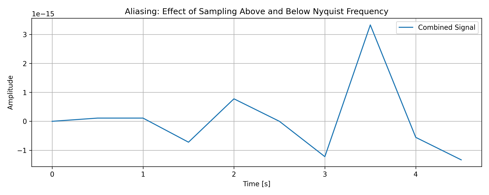
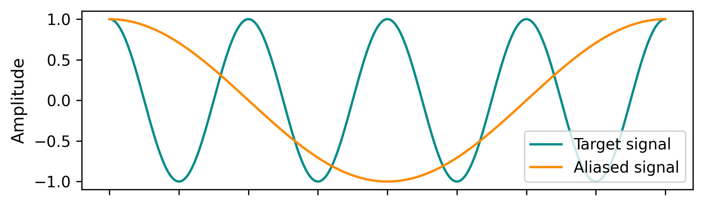
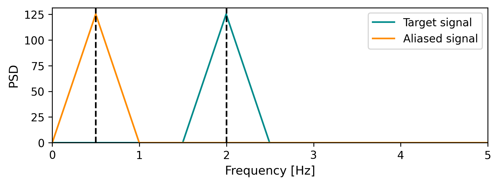
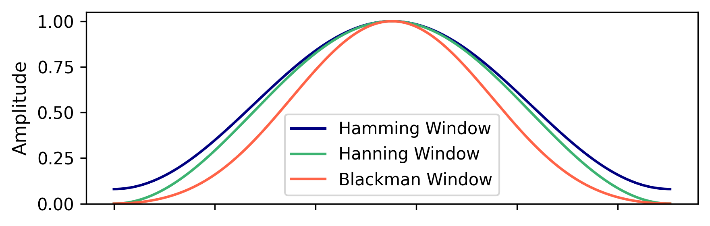
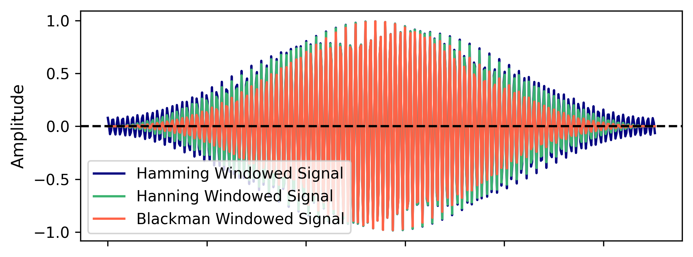
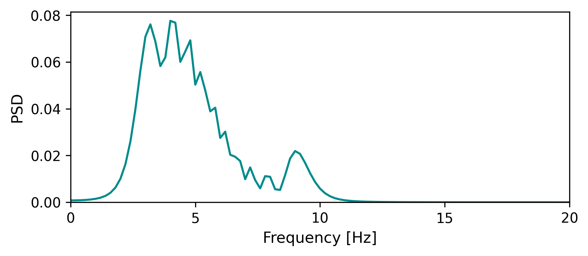
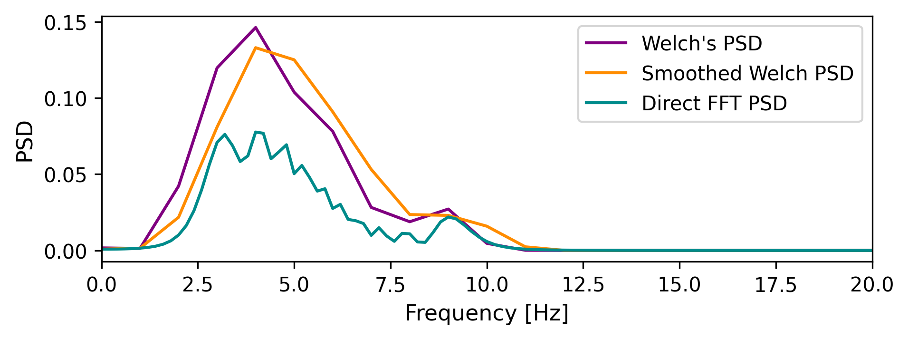

Signal conditioning
===================

Most of the time series recorded by different devices need to be conditioned before
using them in spectral analysis. Different key concepts will be explained in this section
to obtain the most feasible results.

Nyquist frequency
-----------------

It is defined as the minimum sampling rate that allows to reconstruct a signal. This frequency is given by the equation:

.. math::
    f_{Nyquist} = \frac{f_s}{2}

where :math:`f_s` is the sampling frequency.

For instance, if you want to record a signal which has a maximum frequency of 0.5 Hz (2s period), 
you need to sample it at least at 1 Hz. If a lower frequency signal is required, the sampling rate 
must be increased. 

.. math:: 
    \Delta t = \frac{1}{2f_{Nyquist}}

At the end, there is a linear relationship between the sampling frequency and the
maximum frequency that can be processed. Usually a sampling rate of 1Hz is enough for wind-wave analysis.

    Illustration of the Nyquist frequency concept. The sampling rate determines the highest frequency that can be accurately represented.

This is kind of an intuitive assumtion so we are tempted to sample the signal at the ups and downs to avoid losing information.

Aliasing
--------

Aliasing occurs when a signal is sampled at a rate that is too low to capture its highest frequency components, 
leading to distortion in the reconstructed signal. This happens when the sampling frequency is less than twice 
the highest frequency present in the signal (the Nyquist frequency).

Let's have a look at the following example:

    Illustration of aliasing. The original signal is sampled at a rate that is too low, causing high-frequency components to be misrepresented as lower frequencies.

The sampling frequency is clearly below the Nyquist frequency. The PSD of the aliased signal is also computed. 

When a continuous signal with frequency components above the Nyquist frequency is sampled, 
those high frequencies are misrepresented in the sampled signal. They "fold" back into the frequency range 
:math:`[0, f_{s}/2]`, creating aliased frequencies. In this case, the original signal has a frequency of :math:`2\,\mathrm{Hz}`, but the sampling frequency
is 0.5Hz, which is below the Nyquist frequency (1Hz). This means the sampled signal will appear to have a frequency of 0.5Hz, which is incorrect.
It's like mirroring the frequency around the Nyquist frequency

Windowing
---------

The Fast Fourier Transform (FFT) assumes that the time-domain signal is perodic. 
This means that the signal is repeated indefinitely in both directions. 
However, in practice, we only have a finite segment of the signal, so the signal will not likely 
start and end at the same phase/amplitude values. To avoid introducing artifacts in the frequency domain, 
we apply a windowing function to the time-domain signal before performing the FFT.

Assuming that we have the following non fully perodic time series:

.. figure:: ../images/non_full_periodic_signal.png
    :alt: Non fully periodic signal
    :align: center
    :width: 90%

Notice that the end part of the time series does not match the beginning part. Those discontinuities at 
the beginning and end of the time series will generate spurious amplitudes in the adjacent frequencies. We can compute
the Power Spectral Density (PSD) as follows:

INSERT EQUATION HERE

A quick way to visualize this effect is then plotted in the following figure:

.. figure:: ../images/psd_non_periodic_signal.png
    :alt: PSD for non fully periodic signal
    :align: center
    :width: 90%

Fourier Transform can introduce "spectral leakage", spreading the energy across multiple frequency bins 
rather than concentrating it at the correct frequency. A technical way to avoid this effect is to apply a windowing function 
to the time series before computing the FFT.  The windowing function is a mathematical function that tapers the signal to zero at the edges, 
reducing the discontinuities.

So let's say you have a discrete-time signal:

.. math::
    x[n], \quad n = 0, 1, 2, ..., N-1

We can define a window function \( w[n] \), such as the hamming window, that is also of length \( N \):

.. math::

    w[n] = 0.54 - 0.46 \cos\left( \frac{2\pi n}{N-1} \right), \quad n = 0, 1, 2, ..., N-1

This gives us set of weights the same length as our signal. Other windowing functions can be used, such as Hanning, Blackman, etc.
Each has its own characteristics and is chosen based on the specific requirements of the analysis.:

If we apply this hanning window to our signal, we get a new signal in the time domain:

.. math::

    x_w[n] = x[n] \cdot w[n]

This tapers the signal so that it smoothly goes to zero at the edges, reducing the sudden jumps that cause spectral leakage.

Now, when we compute the FFT of this windowed signal, we'll get a cleaner frequency spectrum with less spectral leakage. It 
has to be mentioned that the windowing functions does change the spectral peak and, ultimately, the energy content of the signal.

.. figure:: ../images/psd_windowed_signal.png
    :alt: PSD for windowed signal
    :align: center
    :width: 90%

Sliding windowing
-----------------

Another important requirement to use FFT Is that the signal needs to be stationary (i.e its statistical properties do not change over time).
Oceanographic time series, particularly pressure or surface level series, are not stationary hence can not be directly used in FFT.

Each window is certain percentage overlapped with the next one as is shown:

.. figure:: ../images/non_stationary_signal.png
    :alt: Sliding window example
    :align: center
    :width: 90%

If we directly compute the PSD of the whole signal,...

To overcome this limitation, a technique is used to analyze a portion of a signal at a time, by moving 
the previously defined window across the signal. By breaking the signal into short time segments (windows), 
we can assume local stationarity — that the signal is approximately stationary within each small window.

The PSD can be computed for each overlapping segment. The purpose of the overlapping is having a lower variance 
in the final PSD estimate because the amount of segments is higher than not overlapping. 

.. figure:: ../images/psd_segments_mean.png
    :alt: PSD for each segment and their mean
    :align: center
    :width: 90%

Also, this technique avoids wasting data near the segment boundaries, which is especially important 
because windowing reduces the weight of data at the edges.

Welch method
--------------

This method is finally employeed to estimate the PSD of a signal, producing a smoother and more reliable estimate than a single Fourier transform would, by reducing the variance in the estimate.

If $x[n]$ is your signal, Welch’s method computes:

.. math::

    \hat{P}_{xx}(f) = \frac{1}{K} \sum_{k=1}^{K} \left| \mathrm{FFT}\{ w[n] \cdot x_k[n] \} \right|^2

Where:

- :math:`x_k[n]`: the :math:`k`-th segment of the signal
- :math:`w[n]`: the window function
- :math:`K`: number of segments

The PSD estimate is the average of all the individual PSD computed for each segments

The frequency resolution of the PSD estimate is determined by the length of the segment and the sampling frequency.

.. math:: 
    \Delta f = \frac{f_s}{N}

Where :math:`N` is the length of the segment. Based on that, the frequency resolution is expected to be lower when the Welch method is used, 
as the segments are shorter than the whole signal, which is the case when the FFT is computed directly.

Smoothing
---------

The final PSD estimate can be further smoothed to reduce noise and enhance the visibility of significant peaks. 