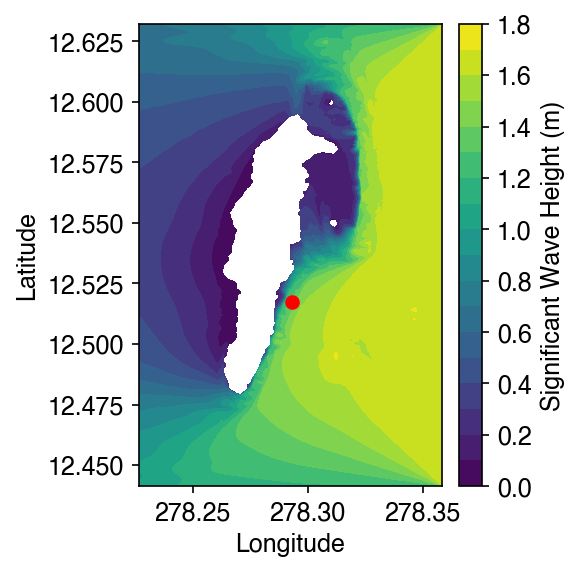
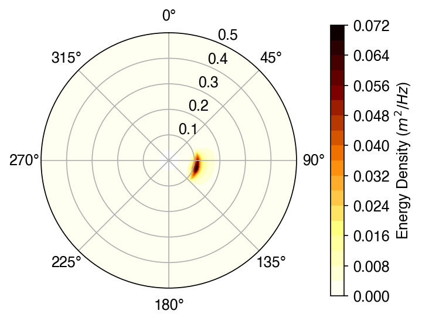
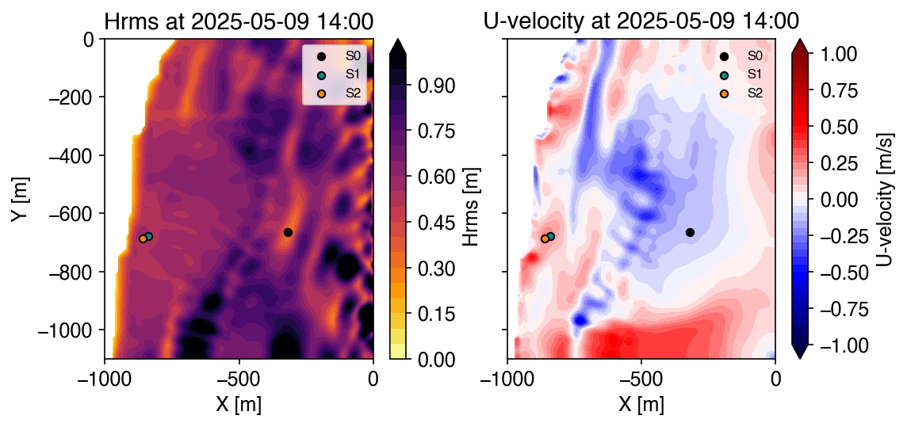
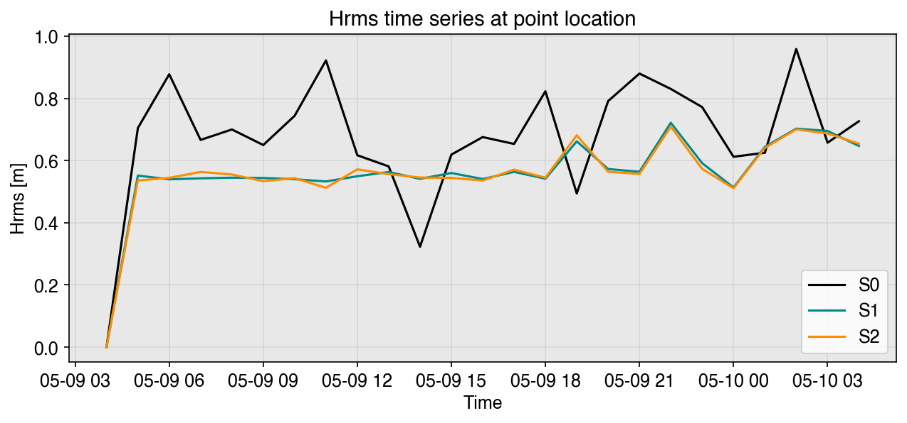

## What is `oceanicospy`?

::: {.incremental}
- Open-source Python **framework** for coastal wave & hydrodynamic modelling workflows
- Standardizes the typical tasks from research groups in oceanography and coastal engineering.
- Seven subpackages, one consistent design language across all of them
- Built on top of well-supported libraries: `numpy`, `xarray`, `pandas`, `geopandas`, `scipy`, `matplotlib`, `wavespectra`, etc.
:::

::: {.notes}
Framing slide — set the scope before diving into structure.
:::

---

## Why build this?

Coastal numerical modelling (SWAN, XBeach, Delft3D, etc.) is a workflow, not a single script, this workflow is:

::: {.incremental}
- **Iterative** — calibration & validation cycles run the same setup over and over, duplicating data and manual steps.
- **Complex** — models demand highly specific formats; setup is error-prone and has a steep learning curve for newcomers.
- **Comprehensive** — data retrieval, in-situ data processing, time-series analysis, and model configuration are usually hardcoded per research group, with no shared standard.
:::

Existing tools tend to be either too narrow (one task) or too rigid to generalize — `oceanicospy` targets the whole pipeline.

---

## High-level structure

```{.tree}
oceanicospy/
├── analysis/         temporal & spectral analysis (WaveSpectralAnalyzer, WaveTemporalAnalyzer, etc.)
├── downloads/        ERA5 · Copernicus Marine (CMDS) · UHSLC fetchers
├── gis/              Grid, ProfileAxis, CRS reprojection, XYZ merging/masking
├── models/           numerical model automation
│   ├── swanpy/       SWAN preprocess → execution → postprocess
│   └── xbeachpy/     XBeach preprocess → execution (+ utils/defaults)
├── observations/     instrument readers (pressure sensors, CTD, weather stations, AWAC, buoy, HOBO)
├── plots/            house style + quick plotting helpers
└── utils/            shared helpers (constants, metrics, wave/wind/water-level math)
```

Every subpackage is a Python package with its own `__init__.py` re-exporting its public classes.

---

## `analysis` 

::: {.incremental}
- Temporal, spectral & statistical characterization of waves:
  - spectral: FFT, Welch method, wavelet transform
  - temporal: zero-upcrossing, Empirical Mode Decomposition (EMD)
  - extremes: peaks-over-threshold (POT), tidal decomposition, climatology
:::

Everything retrieved or derived is transformed to the same conventions used across 
the library — no separate glue code per data source.

---

## `downloads` 

::: {.incremental}
- Three fetchers, one standardized output:
  - `ERA5Downloader` → ECMWF ERA5 reanalysis via the Climate Data Store (CDS) API
  - `CMDSDownloader` → CMEMS global wave/wind fields via the Copernicus Marine Toolbox
  - `UHSLCDownloader` → research-quality tide-gauge records from the University of Hawaii Sea Level Center
:::
---

## `observations` — one reader family per instrument class

```{.tree}
observations/
├── pressure_sensors/   BaseLogger (ABC)  →  RBR · AQUAlogger · Bluelog
├── ctd/                CTDBase (ABC)     →  CastawayCTD · SeaSunMarineTechCTD
├── weather_stations/   WeatherStationBase (ABC) → DavisVantagePro · WeatherSens · Rainwise
├── awac.py             AWAC
├── buoy.py             WaveBuoy
└── hobo.py             HOBO_Temp · HOBO_TempCond
```
There are some **abstract bases per instrument family**, each base represents the typical behaviour of a instrument 
and then there are concrete subclasses per vendor/model.

---

## `models` — the automation core

```{.tree}
models/
├── swanpy/
│   ├── initializer.py        Initializer
│   ├── preprocess/           GridMaker · BathyMaker · BottomFrictionProcessor ·
│   │                         WindForcing · WaterLevelForcing · BoundaryConditions
│   ├── execution/            CaseRunner
│   └── postprocess/          SwanOutputReader
└── xbeachpy/
    ├── initializer.py        Initializer
    ├── preprocess/           GridMaker · BathyMaker · WindForcing ·
    │                         WaterLevelForcing · BoundaryConditions
    ├── execution/            CaseRunner
    └── utils/                defaults (params.txt fallback values)
```

`swanpy` and `xbeachpy` **share the same subpackage structure** on purpose and 
it follows the common steps for modelling worflows

---

## Programming paradigm: Object-Oriented Design

`oceanicospy` leans on OOP in two complementary ways:

::: {.incremental}
1. **Inheritance** — abstract base classes define a stable *contract* per family (instruments), subclasses fill in the vendor-specific parsing.
2. **Composition / shared state** — one *case* object is created once and passed into every collaborating class (models), instead of every class re-deriving the same paths and metadata.
:::

Both patterns keep user-facing code declarative: build small config `dicts`, hand them to a class, call a couple of methods.

---

## Pattern 1 — Inheritance (`observations`)

```{.python}
class BaseLogger(ABC):           # oceanicospy/observations/pressure_sensors/pressure_sensor_base.py
    def get_clean_records(self, detrended=True):
        df = self.get_raw_records()
        df = self._standardize_columns(df)   # ← subclass-defined
        df = self._parse_dates_and_trim(df)
        df = self._compute_depth_from_pressure(df)
        df = self._assign_burst_id(df)        # ← subclass-defined
        ...
        return df

    @abstractmethod
    def _standardize_columns(self, df): ...
    @abstractmethod
    def _assign_burst_id(self, df): ...

class RBR(BaseLogger):        ...            # implements the vendor-specific bits
class AQUAlogger(BaseLogger): ...
class Bluelog(BaseLogger):    ...
```

`get_clean_records()` is the same call for every sensor — a **template-method** pattern.

---

## Pattern 2 — Composition (`models`)

```{.python}
case = Initializer(root_path=path_case, dict_ini_data=ini_case_data)
case.create_folders()
case.replace_ini_data()

case_grid   = GridMaker(init=case, ...)          # `case` is shared, not re-created
case_bathy  = BathyMaker(init=case, ...)
case_winds  = WindForcing(init=case, ...)
case_bounds = BoundaryConditions(init=case, ...)
case_run    = CaseRunner(init=case, dict_comp_data=comp_data)
```

::: {.incremental}
- Every preprocessing class receives the **same `init` (case) object**
- `case` carries `root_path`, `dict_folders`, dates, and the metadata dict being built up
- Each class only adds *its own* section to the model config file (`run.swn` / `params.txt`)
:::

---

## Quick example — `swanpy`, 2D stationary case

San Andrés island — 2D spherical SWAN grid, side boundary forcing

```{.python code-line-numbers="1-2|4-11|13-16"}
from oceanicospy.models.swanpy import Initializer
from oceanicospy.models.swanpy.preprocess import (
    GridMaker, BathyMaker, WindForcing,
    BottomFrictionProcessor, BoundaryConditions,
)
from oceanicospy.models.swanpy.execution import CaseRunner
from oceanicospy.models.swanpy.postprocess import SwanOutputReader

dict_ini_data = dict(name='Stationary case', case_number=1,
                      case_description='Example', stat_id=1,
                      number_domains=1)

case = Initializer(root_path='data/model_runs/stationary_swan/',
                    dict_ini_data=dict_ini_data)
case.create_folders()
case.replace_ini_data()          # writes run.swn from the STAT template
```

---

## `swanpy` — building the domain {.small-code}

```{.python}
case_grid = GridMaker(init=case, domain_number=1, grid_info={
    'lon_ll_corner': 278.2265167, 'lat_ll_corner': 12.4413166,
    'x_extent': 0.13185, 'y_extent': 0.1908, 'nx': 293, 'ny': 424,
})
case_grid.fill_grid_section()

case_bathy = BathyMaker(init=case, domain_number=1, bathy_info={...})
case_bathy.use_ascii_file_from_user()
case_bathy.fill_bathy_section()

case_winds = WindForcing(init=case, domain_number=1)
case_winds.use_constant_wind(wind_speed=6.02, wind_dir=90)
case_winds.fill_wind_section()

case_boundary = BoundaryConditions(init=case, domain_number=1,
    bound_info={"bound_type": "side", "variable_bound": False})
case_boundary.create_boundary_line(list_sides=["E"],
    wave_params={'hs': 1.7, 'tp': 9, 'dir': 90, 'spr': 2})
case_boundary.fill_boundaries_section()
```

One class → one section of `run.swn`. Then `CaseRunner` finalizes the compute block and the case is ready for the SWAN executable.

---

## `swanpy` — template vs. filled `run.swn` 

::: columns
::: {.column width="50%"}
**`run_base_stat.swn`** (bundled template)

```
PROJECT '$name' '$case_number'
'$case_description'
...
CGRID REG $lon_ll_corner $lat_ll_corner 0 \
  $x_extent $y_extent $nx $ny CIRCLE 72 0.04 1
...
WIND $wind_speed $wind_dir
...
BOU SHAP JON PEAK
$boundaries_line
```
:::
::: {.column width="50%"}
**`run.swn`** (this example, after `fill_*_section()`)

```
PROJECT 'Stationary case' '1'
'Example'
...
CGRID REG 278.2265167 12.4413166 0 \
  0.13185 0.1908 293 424 CIRCLE 72 0.04 1
...
WIND 6.02 90
...
BOU SHAP JON PEAK
BOUN SIDE E CLOCKW CON PAR 1.7 9 90 2
```
:::
:::

Every `$placeholder` traces back to a value passed into one of the classes on the previous slide — the template itself never changes between cases, only the substituted values do.

---


## `swanpy` — reading the results

```{.python}
out_reader = SwanOutputReader()
wave_field_ds = out_reader.read_spatial_output(
    output_dir='.../output/domain_01/', filename='wave_field.mat',grid_info=case_grid.grid_info)
```

::: columns
::: {.column width="55%"}
{width="90%"}
:::
::: {.column width="45%"}
{width="100%"}
:::
:::

Both figures come straight out of the `swan_stationary_case` example notebook.

---

## Quick example — `xbeachpy`, 2D case

Sound Bay, San Andrés — non-stationary surfbeat run forced by SWAN spectra, ERA5 winds & UHSLC water levels

```{.python code-line-numbers="1-2|3-11|12-13"}
from oceanicospy.models import xbeachpy

ini_case_data = dict(
    case_description='2D Sound Bay - San Andres',
    act_morf=0, act_sedtrans=0, act_wavemodel=1, dims=2,
)

case = xbeachpy.Initializer(root_path='data/model_runs/2D_xbeach/',
                             dict_ini_data=ini_case_data,
                             ini_date=datetime(2025, 5, 9, 4),
                             end_date=datetime(2025, 5, 10, 4))
case.create_folders()
case.replace_ini_data()      # stamps params.txt from the bundled template
```

---

## `xbeachpy` — grid, bathy & forcing {.small-code}

```{.python}
case_grid = xbeachpy.preprocess.GridMaker(init=case,
    grid_params=dict(thetamin=0, thetamax=190, dtheta=10, alfa=180),
    coordinates_type="relative")
case_grid.build_rectangular_grid.from_shapefile(
    source_file='XBeach_domain.shp', dx=10, dy=10)
case_grid.fill_grid_section()

case_bathy = xbeachpy.preprocess.BathyMaker(init=case)
case_bathy.load_existing_dep(dep_filename='bathymetry.dep')
case_bathy.fill_bathy_section()

case_winds = xbeachpy.preprocess.WindForcing(init=case, wind_info=wind_dict)
case_winds.get_winds_from_ERA5(utc_offset_hours=-5, format_localtime=True)
case_winds.write_ERA5_ascii(era5_filename='winds_era5_localtime.nc',
    ascii_filename='winds.wnd', lon_target=-81.706, lat_target=12.5204)
case_winds.fill_wind_section()

case_bounds = xbeachpy.preprocess.BoundaryConditions(init=case)
case_bounds.spectra_from_swan(input_filename='SpecSWAN.out',
    location_points=[(0, -100*i) for i in range(12)])
case_bounds.fill_boundaries_section()
```

Note the **same shape** as the SWAN example: `Initializer` → `preprocess.*` classes sharing `init=case` → `execution.CaseRunner`.

---

## `xbeachpy` — reading the results

```{.python}
ds_output = xr.open_dataset(f'{path_case}output/SoundBay2D.nc')
ds_field  = ds_output[[v for v in ds_output.data_vars if ds_output[v].ndim > 2]]
ds_point  = ds_output[[v for v in ds_output.data_vars if ds_output[v].ndim == 2]]
```

{width="85%"}

---

## `xbeachpy` — point time series

{width="80%"}

Straightforward `xarray` + `matplotlib` post-processing — `oceanicospy` hands back tidy, labelled datasets so users are not tied to any particular plotting API.

---

## Getting & testing `oceanicospy`

```{.bash}
# latest stable release
pip install oceanicospy

# latest development version
git clone git@github.com:oceanicos-dev-org/oceanicospy.git
```

::: {.incremental}
- License: GNU GPL · versioned with `git` · PRs from a forked copy welcome
- Docs: `oceanicospy.readthedocs.io`
- Core functionality is covered by `tests/`, mirroring the library's own directory structure:

```{.bash}
pytest --cov=oceanicospy tests/
```
:::

---

## Design takeaways

::: {.incremental}
- **Consistent shape**: `swanpy` and `xbeachpy` both split into `preprocess/` → `execution/` (→ `postprocess/`), each class owning one section of the model config file
- **Config as data**: plain `dicts` in, template files (`run.swn`, `params.txt`) out via `string.Template`
- **Composition over inheritance** for model workflows; **inheritance** (ABCs) where a stable per-vendor makes sense (instruments)
- Results come back as `xarray`/`pandas` objects — no lock-in to a specific plotting stack
:::

---

## Why it matters

::: {.incremental}
- Faster iteration on **sensitivity analyses** — spatial, frequency-directional & temporal resolution — without re-plumbing scripts each time
- Lowers the technical barrier for newcomers learning SWAN/XBeach — same shape, less bespoke glue code
- A shared framework across the research group avoids duplicating effort every time modelling practices improve
- Not limited to SWAN & XBeach — the pipeline is designed so new models, data sources, and instruments can slot into the same shape
:::

---

## Let's collaborate

- **Found a bug or have a feature idea?** Open an issue at `github.com/oceanicos-dev-org/oceanicospy/issues`
  - Bug reports: OS + Python/package versions, a minimal reproducible snippet, the full traceback
  - New feature: open the issue first to discuss scope before writing any code
- **Want to work on it yourself?** Fork the repo, then work on a dedicated branch:

```{.bash}
git branch YOUR-USERNAME/my-feature
git checkout YOUR-USERNAME/my-feature
# ...commit your changes...
git push origin YOUR-USERNAME/my-feature
```

Open a pull request from your fork against `main` — a maintainer will review and merge it. See `docs/contributing.rst` for the full checklist (tests, docstrings, `CHANGELOG.md`).

Questions, feedback, and contributions welcome.

